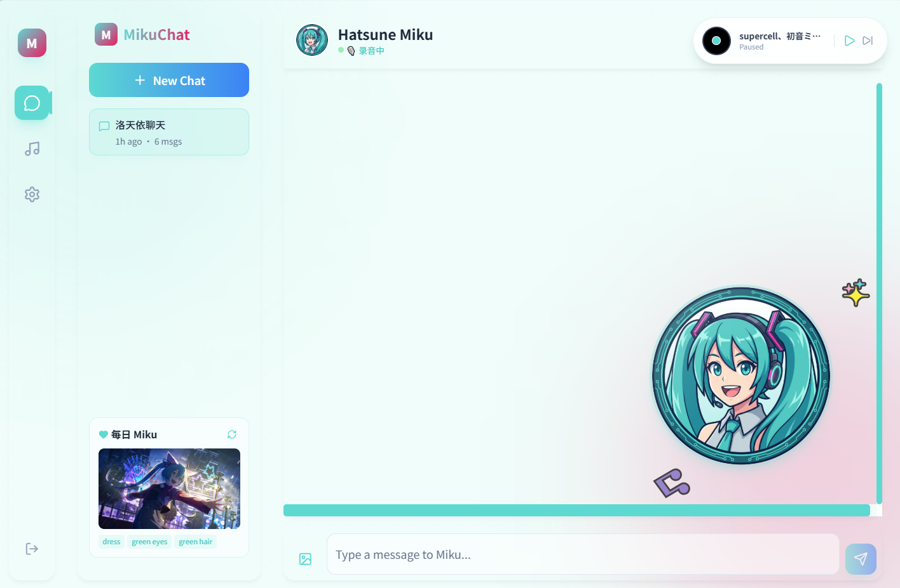
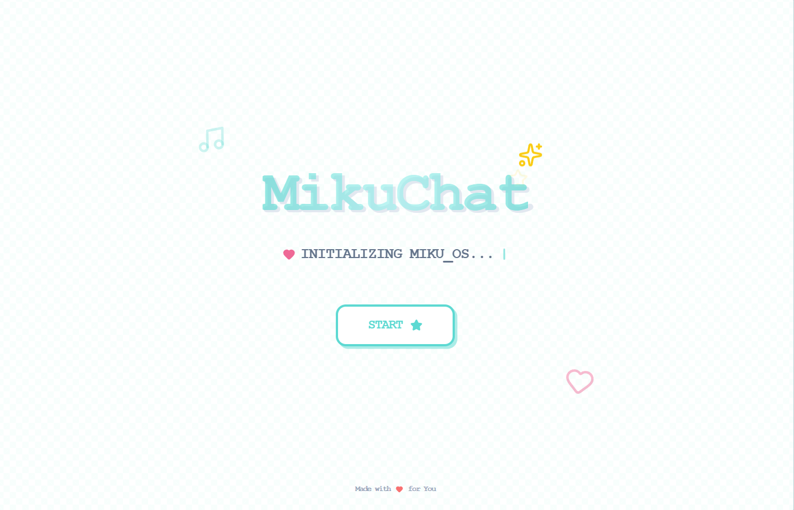
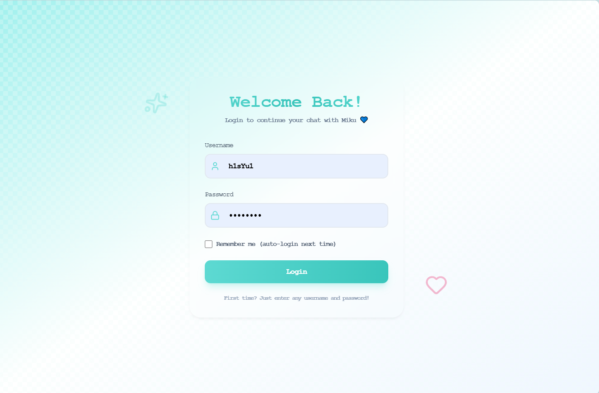

# Contributor
<table>
  <tr>
    <td align="center">
      <a href="https://github.com/ReinerBRO">
        <br />
        <sub><b>ReinerBRO</b></sub>
      </a>
    </td>
    <td align="center">
      <a href="https://github.com/JWLLQ">
        <br />
        <sub><b>JWLLQ</b></sub>
      </a>
    </td>
  </tr>
</table>


# MikuChat 🎵



Readme由AI生成，描述有些夸张，不用在意， 有空就会更新各种功能.......

一个美观、功能丰富的聊天应用，由 Qwen VL 驱动，以初音未来作为你的 AI 伴侣。采用现代 Web 技术构建，拥有令人惊艳的 ACG 风格界面。

## ✨ 功能特性

### 🎨 沉浸式 ACG 体验
- **初音主题设计**：精心调配的 Miku 蓝绿配色方案，配合玻璃态（Glassmorphism）效果，带来极致视觉享受。
- **动态交互**：Miku 拥有随机状态显示（如"练舞中 💃"、"吃大葱中 🥬"）。
- **流畅动画**：由 Framer Motion 驱动的丝滑过渡效果，每一次点击都是享受。
- **多主题支持**：内置 Light、Dark 和 Cyberpunk 三种主题，随心切换。



### 🔐 安全与隐私
- **本地登录系统**：内置安全的本地身份验证系统，保护你的对话隐私。
- **会话隔离**：支持多用户使用，每个用户的聊天记录完全隔离。
- **数据持久化**：所有聊天记录和设置自动保存到本地，随时继续对话。



### 💬 智能多模态对话
- **Qwen VL 驱动**：集成阿里巴巴通义千问视觉语言模型，支持图文对话。
- **图片理解**：发送图片给 Miku，她能精准识别并与你讨论图片内容。
- **上下文记忆**：具备短期记忆能力，能进行连贯的多轮对话。
- **多会话管理**：支持创建多个独立会话，AI 自动根据内容生成会话标题。

### 🎯 贴心功能
- **Otaku 仪表盘**：显示心情指数、同步率等趣味数据。
- **个性化设置**：支持自定义用户名、头像和界面背景透明度。
- **一键启动**：提供简单的启动脚本，无需繁琐配置。

## 🚀 快速开始

无需复杂的命令行操作，我们为您准备了一键启动脚本。

### 前置要求
- Python 3.8+
- Node.js 16+
- DashScope API 密钥（用于 Qwen VL）

### 首次设置

1. **配置环境**
   确保你已经安装了 Python 和 Node.js。

2. **安装依赖**
   ```bash
   # 后端
   cd backend
   pip install -r requirements.txt
   
   # 前端
   cd ../frontend
   npm install
   ```

3. **配置 API 密钥**
   在 `backend` 目录下创建 `.env` 文件：
   ```env
   DASHSCOPE_API_KEY=your-api-key-here
   ```

### 启动应用

只需运行根目录下的启动脚本即可同时启动前端和后端：

- **Windows**: 双击运行 `start.bat`
- **Linux/Mac**: 运行 `./start.sh`

应用启动后，浏览器将自动打开 `http://localhost:5173`。

## 🛠️ 技术栈

### 后端
- **FastAPI**: 高性能 Python Web 框架
- **Qwen VL**: 强大的视觉语言大模型
- **Session Auth**: 基于文件的会话管理系统

### 前端
- **React 18**: 构建用户界面的核心库
- **Vite**: 下一代前端构建工具
- **Tailwind CSS**: 原子化 CSS 框架
- **Framer Motion**: 生产级动画库
- **Lucide React**: 优雅的图标库

## 📁 项目结构

```
MikuChat/
├── backend/                 # Python FastAPI 后端
│   ├── sessions/            # 用户会话数据存储
│   ├── main.py              # 应用入口
│   ├── chat_manager.py      # 核心聊天逻辑
│   └── ...
├── frontend/                # React 前端
│   ├── src/
│   │   ├── components/      # UI 组件 (ChatInterface, LoginPage, etc.)
│   │   └── ...
│   └── ...
├── start.bat                # Windows 启动脚本
├── start.sh                 # Linux/Mac 启动脚本
├── mikuchat.png             # 项目展示图
├── login.png                # 登录界面截图
├── 1.png                    # 聊天界面截图
└── README.md                # 项目文档
```

## 🎵 关于 Miku

初音未来（初音ミク）是一位虚拟歌手，也是世界上最著名的 Vocaloid。在 MikuChat 中，她是你开朗、充满活力的 AI 伴侣，热爱音乐，随时准备帮助你！

## 📝 许可证

本项目仅供教育和个人使用。

---

用 💙 制作，献给 Miku 粉丝
