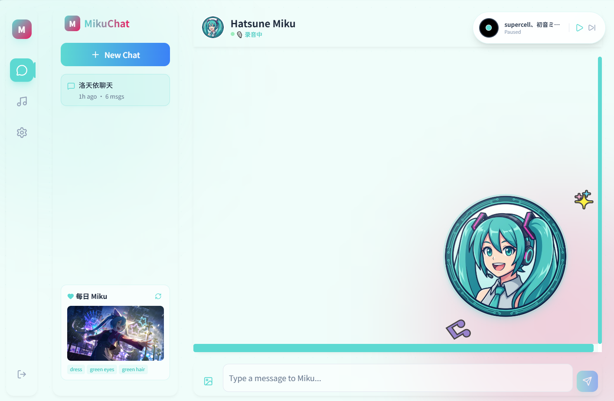

# Contributor
<table>
  <tr>
    <td align="center">
      <a href="https://github.com/ReinerBRO">
        <br />
        <sub><b>ReinerBRO</b></sub>
      </a>
    </td>
    <td align="center">
      <a href="https://github.com/JWLLQ">
        <br />
        <sub><b>JWLLQ</b></sub>
      </a>
    </td>
  </tr>
</table>


# MikuChat 🎵



一个美观、功能丰富的聊天应用，由 Qwen VL 驱动，以初音未来作为你的 AI 伴侣。采用现代 Web 技术构建，拥有令人惊艳的 ACG 风格界面，并集成了本地 **GPT-SoVITS** 语音合成系统。

## ✨ 功能特性

### 🎨 沉浸式 ACG 体验
- **初音主题设计**：精心调配的 Miku 蓝绿配色方案，配合玻璃态（Glassmorphism）效果，带来极致视觉享受。
- **动态交互**：Miku 拥有随机状态显示（如"练舞中 💃"、"吃大葱中 🥬"）。
- **流畅动画**：由 Framer Motion 驱动的丝滑过渡效果，每一次点击都是享受。
- **Live2D 集成**：支持 Live2D 模型，Miku 可以在蒸汽波风格的 3D 空间中与你互动，支持实时缩放调整。

### 🔊 本地 GPT-SoVITS 语音合成
- **真实 Miku 音色**：集成本地 GPT-SoVITS 引擎，生成纯正、高质量的初音未来中文语音。
- **情感驱动语音**：AI 会根据对话内容自动生成情感标签（如 `[HAPPY]`, `[ANGRY]`, `[SURPRISED]`），实时切换对应的参考音频和语调。
- **一键开关**：聊天界面内置语音开关，用户可随时在“极速文字”与“沉浸语音”模式间切换。
- **性能优化**：支持启动时预热加载模型，适配 Mac M 系列芯片，解决 TorchCodec 兼容性问题。

### 💬 智能多模态对话
- **Qwen VL 驱动**：集成阿里巴巴通义千问视觉语言模型，支持图文对话。
- **图片理解**：发送图片给 Miku，她能精准识别并与你讨论图片内容。
- **上下文记忆**：具备长期记忆能力，能进行连贯的多轮对话。

### 🎵 音乐站与资讯
- **Bilibili 音乐搜索**：直接搜索 Bilibili 上的音乐视频。
- **本地音乐管理**：支持播放本地音频文件，带有黑胶唱片动效。
- **Miku News**：实时抓取 Piapro 官方博客，推送最新的 Miku 相关新闻。

## 🚀 快速开始

### 前置要求
- Python 3.10+ (推荐使用 Conda 建立 `mikuchat` 环境)
- Node.js 16+
- DashScope API 密钥（用于 Qwen VL）
- 显存/内存要求：建议至少 16GB RAM (Mac M 系列表现优异)

### 首次设置

1. **配置后端环境**
   ```bash
   cd backend
   conda create -n mikuchat python=3.10
   conda activate mikuchat
   pip install -r requirements.txt
   ```

2. **配置 API 密钥**
   在 `backend` 目录下创建 `.env` 文件：
   ```env
   DASHSCOPE_API_KEY=your-api-key-here
   ```

3. **模型下载**
   项目需要 GPT-SoVITS 底模和 Miku 权重文件，请确保将其放置在 `backend/models/gpt_sovits/miku/weights/`。

### 启动应用

只需运行根目录下的启动脚本：

- **Windows**: 双击运行 `start.bat`
- **Linux/Mac**: 运行 `./start.sh`

## 🛠️ 技术栈

### 后端
- **FastAPI**: 高性能异步 Python Web 框架
- **GPT-SoVITS**: 强大的本地语音克隆与合成系统
- **Qwen VL**: 领先的视觉语言大模型
- **SQLAlchemy/File storage**: 灵活的会话管理

### 前端
- **React 18** / **Vite** / **Tailwind CSS**
- **Framer Motion**: 动画引擎
- **PixiJS & Live2D SDK**: 虚拟伴侣渲染引擎

## 📁 项目结构

```
MikuChat/
├── backend/                 # 后端逻辑
│   ├── gpt_sovits_core/     # GPT-SoVITS 核心库
│   ├── models/              # Miku 权重与参考音频
│   ├── main.py              # 应用入口
│   └── tts_service.py       # 语音合成逻辑
├── frontend/                # 前端 React 项目
├── start.sh                 # Mac/Linux 一键启动
├── mikuchat.png             # 项目展示
└── README.md                # 项目文档
```

## 📝 许可证

本项目仅供学习交流使用，请勿用于商业用途。

---

用 💙 制作，献给 Miku 粉丝
