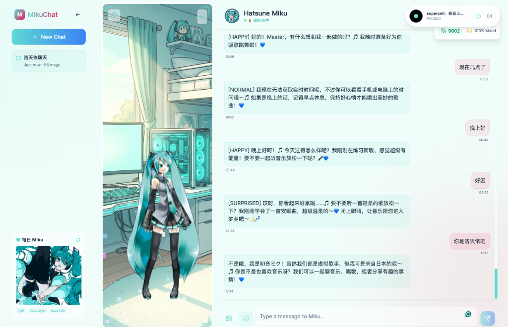
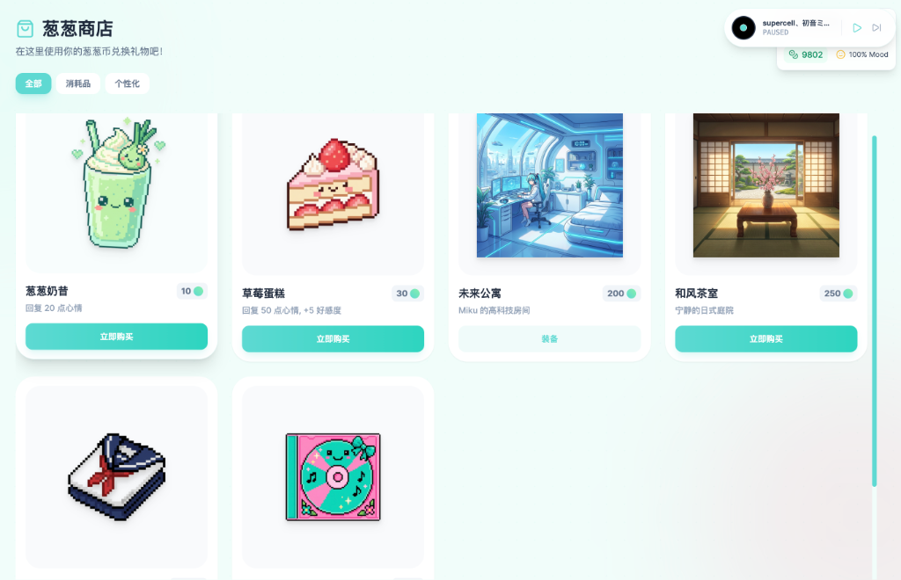
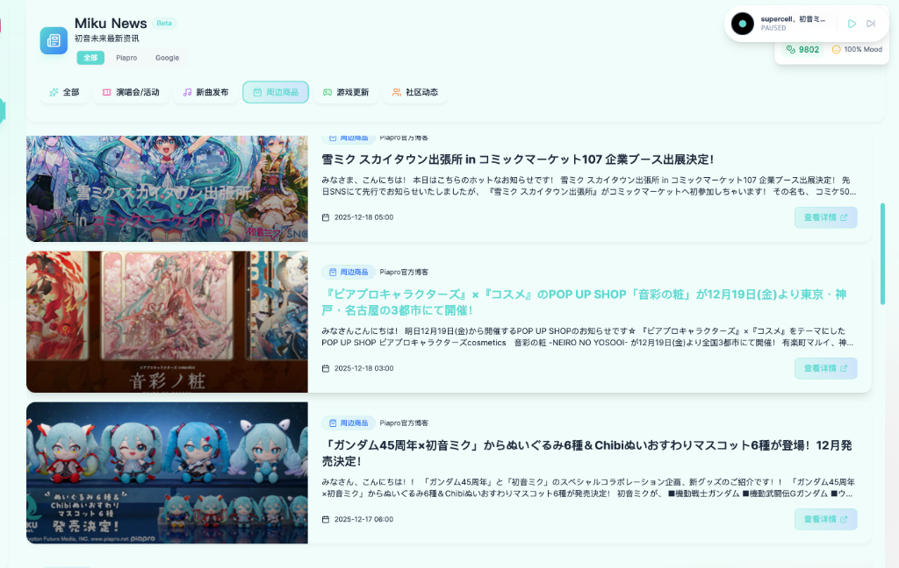
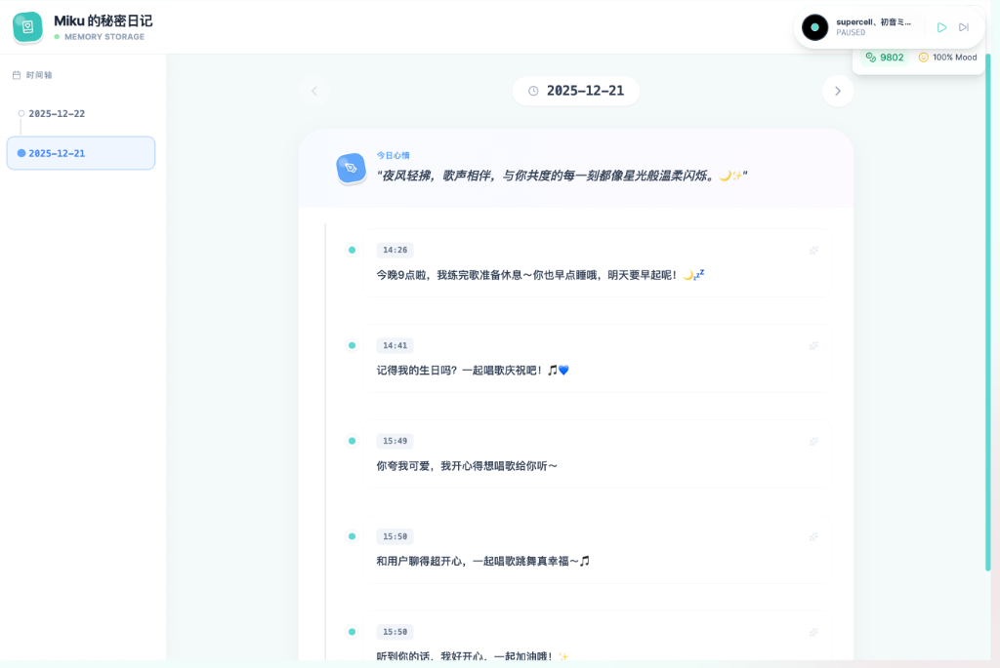

# Contributor
<table>
  <tr>
    <td align="center">
      <a href="https://github.com/ReinerBRO">
        <br />
        <sub><b>ReinerBRO</b></sub>
      </a>
    </td>
    <td align="center">
      <a href="https://github.com/JWLLQ">
        <br />
        <sub><b>JWLLQ</b></sub>
      </a>
    </td>
  </tr>
</table>


# MikuChat 🎵


> *与 Miku 在赛博空间中共度美好时光，支持多场景切换与情感互动。*

一个美观、功能丰富的聊天应用，由 Qwen VL 驱动，以初音未来作为你的 AI 伴侣。采用现代 Web 技术构建，拥有令人惊艳的 ACG 风格界面，并集成了本地 **GPT-SoVITS** 语音合成系统。

## ✨ 核心特性

### 🎨 沉浸式 ACG 体验
- **多场景切换系统**：内置 "温馨卧室"、"赛博舞台" 和 "和风茶室" 等多种高画质背景，支持随心切换。
- **Live2D 深度集成**：支持 Live2D 模型，Miku 可以在 3D 空间中与你互动，支持实时缩放比例调整。
- **动态情感反馈**：聊天气泡会自动隐藏情感标签（如 `[HAPPY]`），但 Miku 的表情和动作会根据情感实时变化，仿佛拥有灵魂。
- **8-Bit 粒子特效**：背景融合了复古与未来的 8-Bit 粒子系统，随音乐和输入律动。

### 🛍️ 葱葱商店与货币系统
- **经济系统**：通过聊天、摸头互动赚取 "葱葱币" (NegiCoin)。
- **虚拟商城**：使用葱葱币购买新的 **背景房间**（如赛博公寓、日式庭院）或 **限定服装**。
- **好感度机制**：随着互动加深，解锁更多 "初音的秘密日记" 和隐藏语音。

### 🔊 本地 GPT-SoVITS 语音合成
- **真实 Miku 音色**：集成本地 GPT-SoVITS 引擎，生成纯正、高质量的初音未来中文语音。
- **情感驱动语音**：AI 自动分析对话情感，实时切换开心、惊讶、温柔等多种语调。

### 📰 生活化功能
- **Miku News**：实时抓取 Piapro 官方动态，不错过任何 Miku 周边和演唱会信息。
- **秘密日记**：记录你们的点滴回忆，随着好感度提升，Miku 会写下关于你的私密日记。
- **Qwen VL 视觉**：支持发送图片，Miku 能看懂你分享的照片并进行互动。

### 🌏 完整中文界面
- **全中文本地化**：界面完全中文化，包括设置、聊天列表、状态面板、好感度等级等。
- **日语名称显示**：Miku 的名字显示为日语原文「初音ミク」。
- **中文问候语**：初始对话使用亲切的中文问候。

### 🎭 头像与个性化
- **多头像选择**：在设置中可选择 3 种精美 Miku 头像（微笑/和风/思考）。
- **可拖拽状态面板**：好感度/葱币/心情面板可自由拖拽位置，支持折叠。
- **记住我登录**：支持自动登录，下次启动无需重新输入密码。

## 📸 精彩预览

| 👗 葱葱商店 (Shop) | 📰 Miku News (资讯) | 📔 秘密日记 (Diary) |
| :---: | :---: | :---: |
|  |  |  |
| *购买新背景和服装* | *获取最新 Miku 资讯* | *解锁你们的专属回忆* |

## 🚀 快速开始

### 前置要求
- Python 3.10+ (推荐使用 Conda 建立 `mikuchat` 环境)
- Node.js 16+
- DashScope API 密钥（用于 Qwen VL）
- 显存/内存要求：建议至少 8GB RAM 
- **PyTorch 版本**：项目默认使用 **CPU 版本 PyTorch**，以确保最大的兼容性和最简单的安装体验。

> [!TIP]
> **NVIDIA GPU 用户可选加速**：如果你有 NVIDIA 显卡并希望加速语音生成，可以手动安装 CUDA 版本的 PyTorch（使用清华源加速下载）：
> ```bash
> pip uninstall torch torchvision torchaudio -y
> pip install torch torchvision torchaudio -i https://pypi.tuna.tsinghua.edu.cn/simple
> ```
> 
> ⚠️ **注意**：CUDA 版本可能存在与本地 CUDA 驱动版本不匹配的问题。如果遇到 GPU 相关错误，建议回退到 CPU 版本或参考 [PyTorch 官网](https://pytorch.org/get-started/locally/) 选择适合你显卡驱动的版本。

### 首次设置

1. **配置 API 密钥**
   
   本项目使用 [SiliconFlow](https://cloud.siliconflow.cn/i/5xh9b6hq) 提供的 API 服务（Qwen VL 模型）。
   
   > [!TIP]
   > **新用户福利**：首次注册并实名认证后，SiliconFlow 将赠送 **14 元代金券**，按目前的模型价格，日常聊天可以用很久！
   
   **获取 API Key 步骤**：
   1. 访问 [SiliconFlow 注册页面](https://cloud.siliconflow.cn/i/5xh9b6hq)
   2. 注册账号并完成实名认证
   3. 进入控制台 → **API 密钥** → **新建密钥**
   4. 复制生成的密钥，替换 `backend/.env` 文件中 `SILICONFLOW_API_KEY=` 后面的 `your-api-key-here`

2. **下载权重文件 (必需)**
   
   由于 GitHub 无法存储大体积模型，**不论使用哪种安装方式（一键安装或手动部署）或哪个平台（Windows/macOS）**，都必须从网盘下载模型资源包：
   
   > 🔗 **百度网盘下载**: [点击跳转](https://pan.baidu.com/s/1kYebQjPUFR6VDjvKzu-Q_w?pwd=3939) (提取码: 3939)
   
   **安装方法：**
   1. 将网盘中的 `backend` 文件夹完整下载。
   2. 直接将其拖入项目根目录中，与现有的 `backend` 文件夹进行 **合并/覆盖**。
   3. **结果**：这会自动补全 `Miku 专属权重`、`基础底模` 以及 `G2PW 文本模型`。
   
   *(注：你也可以运行 `python backend/download_base_models_v2.py` 自动下载部分通用底模，但手动从网盘覆盖是最全、最稳妥的方式)*

### ⚡ Windows 一键安装 (推荐)

如果你是 Windows 用户，可以使用我们提供的一键安装脚本：

1. **运行脚本**：双击项目根目录下的 **`setup_windows.bat`**
2. **全自动安装**：脚本会自动检测并安装以下依赖（如果未安装）：
   - Miniconda (Python 环境管理)
   - Node.js (前端构建)
3. **效果**：自动创建 `mikuchat` 环境、安装所有依赖并完成前端构建

> [!NOTE]
> 整个过程无需手动干预，适合新手用户。

### 🍎 macOS 一键安装

如果你是 macOS 用户，可以使用我们提供的一键安装脚本：

1. **运行脚本**：在终端中执行 `chmod +x setup_macos.sh && ./setup_macos.sh`
2. **全自动安装**：脚本会自动检测并安装以下依赖（如果未安装）：
   - Homebrew (macOS 包管理器)
   - Miniconda (Python 环境管理)
   - Node.js (前端构建)
3. **效果**：自动创建 `mikuchat` 环境、安装所有依赖并完成前端构建

---

### 🖥️ Windows 手动部署指南

1. **环境准备**
   - 安装 [Miniconda](https://docs.conda.io/en/latest/miniconda.html) 或 Anaconda。
   - 安装 [Node.js](https://nodejs.org/) (推荐 LTS 版本)。
   - 安装 [Git](https://git-scm.com/download/win)。

2. **克隆与安装**
   打开 CMD 或 PowerShell：
   ```bash
   git clone https://github.com/ReinerBRO/MikuChat.git
   cd MikuChat/backend
   conda create -n mikuchat python=3.10
   # 如果 npm run build 因为类型错误失败，请使用以下命令跳过检查直接构建：
   npx vite build
   ```

5. **启动应用**
   回到根目录，双击 `start.bat` 即可一键启动前后端。或者双击 `MikuChat.bat` 进入桌面模式。

### 🖥️ 桌面端运行 (Windows & macOS)

如果你想要更像“软件”的体验，可以使用我们封装的桌面模式：

1. **Windows**: 直接双击项目根目录下的 `MikuChat.bat`。
2. **macOS**: 直接双击项目根目录下的 `MikuChat.command`。
3. **效果**: 它会自动开启后端并弹出一个独立的 MikuChat 原生窗口，无需打开浏览器。

> [!IMPORTANT]
> **桌面模式依赖 `frontend/dist` 目录**。如果双击后报错，请确保已在 `frontend` 目录下执行过 `npx vite build`。

---

### 启动应用

只需运行根目录下的启动脚本：

- **Windows**: 双击运行 `start.bat`
- **Linux/Mac**: 运行 `./start.sh`

## 🛠️ 技术栈

### 后端
- **FastAPI**: 高性能异步 Python Web 框架
- **GPT-SoVITS**: 强大的本地语音克隆与合成系统
- **Qwen VL**: 领先的视觉语言大模型
- **SQLAlchemy/File storage**: 灵活的会话管理

### 前端
- **React 18** / **Vite** / **Tailwind CSS**
- **Framer Motion**: 动画引擎
- **PixiJS & Live2D SDK**: 虚拟伴侣渲染引擎

## 📁 项目结构

```
MikuChat/
├── backend/                 # 后端逻辑 (API, TTS, LLM)
├── frontend/                # 前端 React 项目
├── docs/                    # 项目文档与截图
├── start.sh                 # Mac/Linux 一键启动
└── README.md                # 项目文档
```

## 📝 许可证

本项目仅供学习交流使用，请勿用于商业用途。

---

